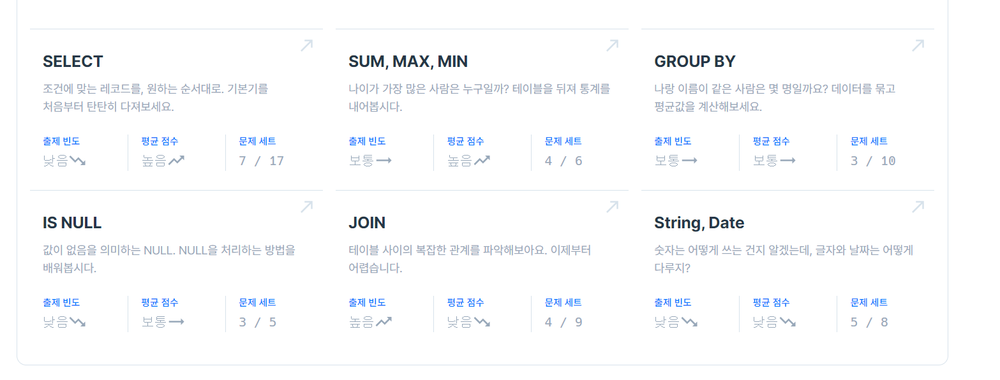

* SELECT - 상위 n개의 레코드
```sql
SELECT NAME
from ANIMAL_INS
ORDER BY DATETIME asc
LIMIT 1;
```
-> 들어온 순서대로 가져오는 것이기에 order by를 이용하였습니다.  
<br/>    

* SUM, MAX, MIN - 중복 제거하기
```sql
SELECT count(distinct NAME)
from ANIMAL_INS
where NAME is not null;
```
-> 이름이 null이 아니고 중복이 아니어야 하기에 distinct를 이용하였습니다.

<br/>

* GROUP BY - 입양 시각 구하기 (1)
```sql
SELECT HOUR(DATETIME), count(*)
from ANIMAL_OUTS
where HOUR(DATETIME) between 9 and 19
group by HOUR(DATETIME)
order by HOUR(DATETIME) asc;
```
-> 시각별로 구해야해서 group by를 이용해서 DATETIME의 HOUR마다 그룹지었습니다.  
-> 9와 19시 사이어야 하고 오름차순으로 구현하였습니다.  

<br/>

* IS NULL - NULL 처리하기
```sql
SELECT ANIMAL_TYPE, IFNULL(NAME,"No name") as Name, SEX_UPON_INTAKE
FROM ANIMAL_INS
```
-> IFNULL을 이용하여 null인 경우에 대한 예외를 처리하였습니다. 

<br/>

* JOIN - 있었는데요 없었습니다.
```sql
SELECT ANIMAL_OUTS.ANIMAL_ID, ANIMAL_OUTS.NAME
FROM ANIMAL_INS JOIN ANIMAL_OUTS
ON ANIMAL_INS.ANIMAL_ID = ANIMAL_OUTS.ANIMAL_ID
WHERE ANIMAL_INS.DATETIME > ANIMAL_OUTS.DATETIME
ORDER BY ANIMAL_INS.DATETIME asc;
```
-> 일반적인 join을 이용했으며 on을 이용하였습니다.  
-> where을 통해서 조건을 추가적으로 주었습니다.

<br/>

* String, Date - 오랜 기간 보호한 동물(2)
```sql

SELECT A.ANIMAL_ID, A.NAME
FROM ANIMAL_INS A JOIN ANIMAL_OUTS B
ON A.ANIMAL_ID = B.ANIMAL_ID
ORDER BY B.DATETIME - A.DATETIME desc
LIMIT 2;
```
-> join을 이용하였으며 on을 이용하였습니다.  
-> 두 테이블의 datetime을 빼서 처리하였습니다. 